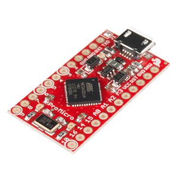
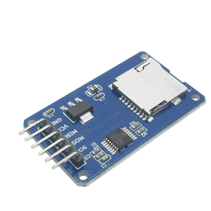
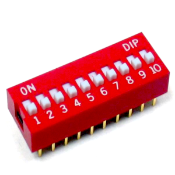

# Arduino BadUSB
A **Ducky Script** interpreter that runs on an **Arduino**, decodes and executes scripts saved on a **microSD** card.

The goal of this project is to recreate an affordable and DIY alternative to the legendary [Rubber Ducky](https://hak5.org/products/usb-rubber-ducky-deluxe) from Hak5. Ideally capable of executing most if not all Ducky Script payloads already available out there, without the need of parsing/converting them beforehand.

This project is based on the [original version](https://github.com/Seytonic/Duckduino-microSD) from [Seytonic](https://twitter.com/seytonic), kudos to him for the inspiration and the initial implementation.

## Hardware:
### Components:
There are 3 basic components required for this project:

 - **Arduino board**
 - **Micro SD module**
 - **DIP switch**

**Arduino board:** The Arduino board it's where the code for our BadUSB will be stored and processed, it will be the one in charge of parsin our scripts and connecting with the target computer.

 For this particular implementation the [Pro Micro - 5V/16MHz](https://www.sparkfun.com/products/12640) from SparkFun is used, featuring an 8-bit ATmega32U4 and Arduino support out of the box. The original board can get quite expensive, so I recommend getting a third party implementation from AliExpress for a fraction of the cost (~$6).

<p align="center">
  
</p>

**Micro SD module:** Our micro SD card module will be used to store our different scripts, this saves us from having to reprogram/reupload our code into the Arduino every time we want to modify our script/s.

There's no specific micro SD card module that has to be used for it to work with our board, just make sure that it is Arduino compatible (it has to support the SPI communication protocol), but most manufacturers will simply specify that it works with Arduino in the product description. These modules are also sold in AliExpress for a very low cost (~$0.45)

<p align="center">
  
</p>

**DIP switch:** The DIP switch is what will enable us to select our script from the variety of payloads stored in our SD without the need of having to edit our code to do so.

Once again there is no specific DIP switch that has to be used, actually you don't even have to use a DIP switch at all. You could use a combination of individual switches and put them together, but given that we want to minimize the size of our USB I recommend getting one. These switches are also available in AliExpress at a very low cost (~$1) for 5 switches.

<p align="center">
  
</p>

### Setup:
TODO

## Configuration:
### Arduino:
There are a couple of settings that can be changed in the code to better suit your needs. This settings are inevitably hardcoded, so to modify them you will need to edit the code.

The following settings are available and can be changed:
| Configuration | Description | Default value |
|---|---|---|
| **SD_PIN** | Pin to be used to connect the micro SD module to the Arduino. | `4` |
| **PINS** | Pins that will be used as an input for the DIP switch. | `5, 6, 7, 8, 9` |
| **MAX_READ_LENGTH** | Maximum chunk size of a _STRING_ command that can be held in memory at once. | `1024` |
| **FILE_EXTENSION** | File extension of the script files. | `.txt` |
| **INITIAL_DELAY** | Delay in milliseconds that will be used before the first command is executed. | `800` |
| **DEFUALT_COMMAND_DELAY** | Delay in milliseconds to be used between each command. | `0` |
| **KEYSTROKE_COMBOS_DELAY** | Delay in milliseconds used between each keystroke when pressing a combination of keys. | `5` |

### Files:
The micro SD card where the files will be stored must be in the **FAT32** format in order for the Arduino to be able to read it. After that, script files can be simply copied on to the SD card with their name being their DIP switch combination (don't panic, this will be explained later).

For now you only keep in mind that each script will have a name from `00000` to `11111` followed by the `.txt` extension (if you haven't changed it).

The SD card should look something like this:
```
/
├── 00001.txt
├── 00010.txt
├── 00011.txt
├── ...
└── 11111.txt
```

## Usage:
Once everything is set up, you can now start using your new BadUSB! But how?

Until now we've been talking about the DIP switch and how it will allow us to select from a variety of scripts on the go, but how do we actually use it? The answer is binary!

Binary is simply another way of encoding numbers, it's a way of representing numbers using only `0` and `1`. If you are familiar with the binary system, you will have no problem understanding how this will help us to select our scripts.

As shown previously, every file will have a name from `00001` to `11111`. These numbers are actually the binary representation of numbers `1` up to `31`. But because our DIP switch only understands `0` or `1` we need to work with numbers in this format.

The goal of this section is not to teach you in-depth how binary numbers work, but to demonstrate why this approach is the best one to use. You don't even need to know binary to operate the DIP switch.

The easiest way of knowing what combination to use is to have a list of all your scripts and their DIP switch combination (which is alfo their filename). Then you simply put the different switches into position (`0` or `1`) and when you connect your BadUSB, the Arduino will take care of the rest.

```
00001 -> Local DNS Poisoning
00010 -> Windows Password Grabber
00011 -> Netcat Reverse Shell
...
11111 -> Hotdog Wallpaper
```


## TODO:
**Disclaimer:** This project is in a very early stage so there are a lot of things to get done, lot's of things may change during development and that's okay. But for now this are the things that need to be edited/added at the moment:

- [X] Add support for the **DEFAULT_DELAY** command.
- [X] Add an initial delay for every script to avoid errors.
- [ ] First DIP switch position combination should be a "safe mode"
- [ ] Allow more user-friendly script names.
- [ ] Migrate to the **NicoHood HID** library.
- [ ] Add number pad support.
- [ ] Add support for the **PRINTSCREEN** key.
- [ ] Add schematic design for the circuit.
